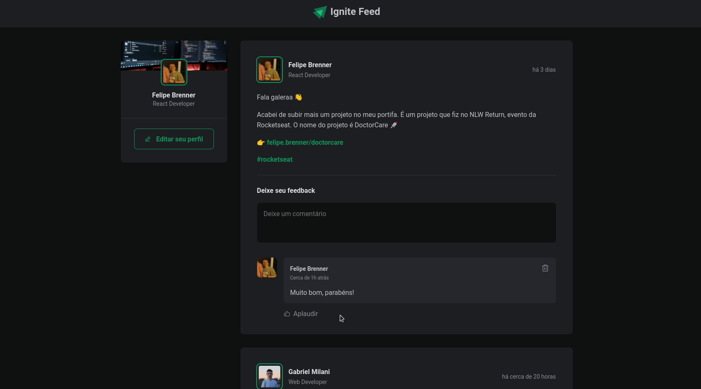

## 🚀 Tecnologias

- Vite
- ReactJS
- TypeScript

## 💻 Projeto

  

## 🔖 Layout

Você pode visualizar o layout do projeto através [desse link](https://www.figma.com/community/file/1113573231685349036). Lembrando que você precisa ter uma conta no [Figma](http://figma.com/) para acessá-lo.
